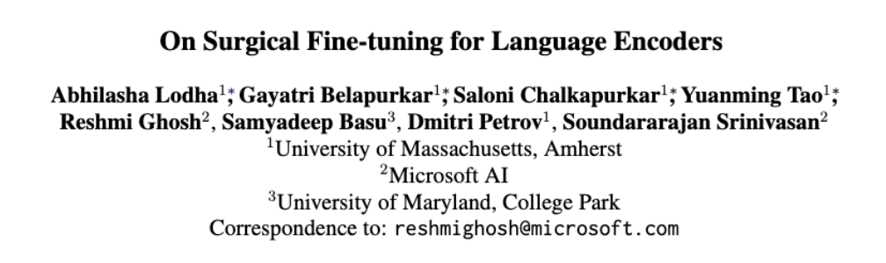

# On Surgical Fine-tuning for Language Encoders

> Method to surgically finetune language encoders with a subset of layers to perform close to full-finetuning!

This repository contains the code for our  (EMNLP Findings 2023): 

## Abstract 
Fine-tuning all layers of a pre-trained neural language encoder is commonly done to adapt it to a new task, but our research demonstrates that selectively fine-tuning a subset of layers, identified using an efficient method based on the Fisher Information Matrix, can achieve comparable or even improved performance across different downstream language tasks, indicating that task-specific information is often localized within a few layers of the encoder.

## Set up
This code was tested with Python 3.9.16, Pytorch 1.12.1 using pre-trained models through huggingface/transformers 4.28.1. Additional required packages are listed in the `requirements.txt` file. The code was tested on a Tesla M40 24GB GPU but should work on other cards with at least 24GB VRAM for BERT-base model.

## Repository Structure and Descriptions
- `checkpoints/` contains fine-tuned models

- `configs/` contains the configurations being used to train the GLUE and SuperGLUE tasks

- `code/` python scripts for analysis 
  - `data_loader.py`: for getting samples or train/val split from GLUE/SuperGLUE Benchmark 
  - `fim_calculator`: for calculating fisher information wrt. layers
  - `fine_tuner.py`: for fine tuning bert models for different tasks
